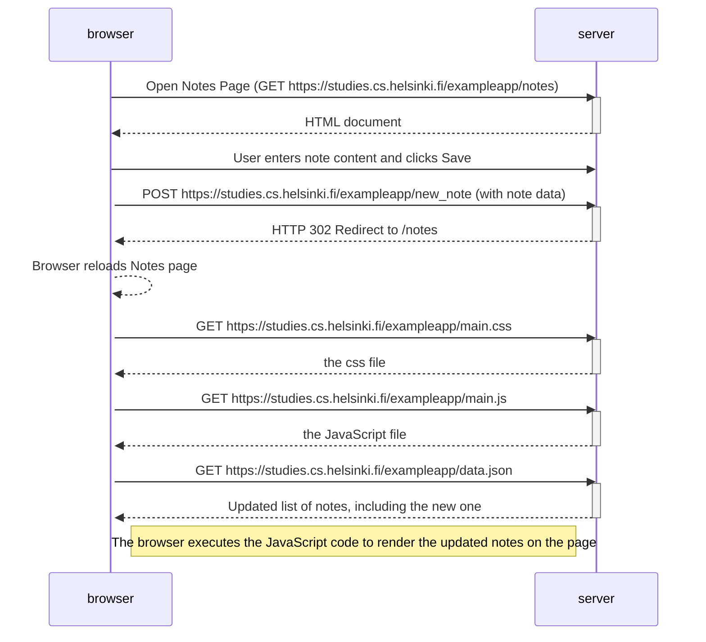

```mermaid
sequenceDiagram
    participant browser
    participant server

    browser->>server: Open Notes Page (GET https://studies.cs.helsinki.fi/exampleapp/notes)
    activate server
    server-->>browser: HTML document
    deactivate server

    browser->>server: User enters note content and clicks Save
    activate browser
    browser->>server: POST https://studies.cs.helsinki.fi/exampleapp/new_note (with note data)
    activate server
    server-->>browser: HTTP 302 Redirect to /notes
    deactivate server
    browser-->>browser: Browser reloads Notes page

    browser->>server: GET https://studies.cs.helsinki.fi/exampleapp/main.css
    activate server
    server-->>browser: the css file
    deactivate server

    browser->>server: GET https://studies.cs.helsinki.fi/exampleapp/main.js
    activate server
    server-->>browser: the JavaScript file
    deactivate server

    browser->>server: GET https://studies.cs.helsinki.fi/exampleapp/data.json
    activate server
    server-->>browser: Updated list of notes, including the new one
    deactivate server

    Note right of browser: The browser executes the JavaScript code to render the updated notes on the page

```
