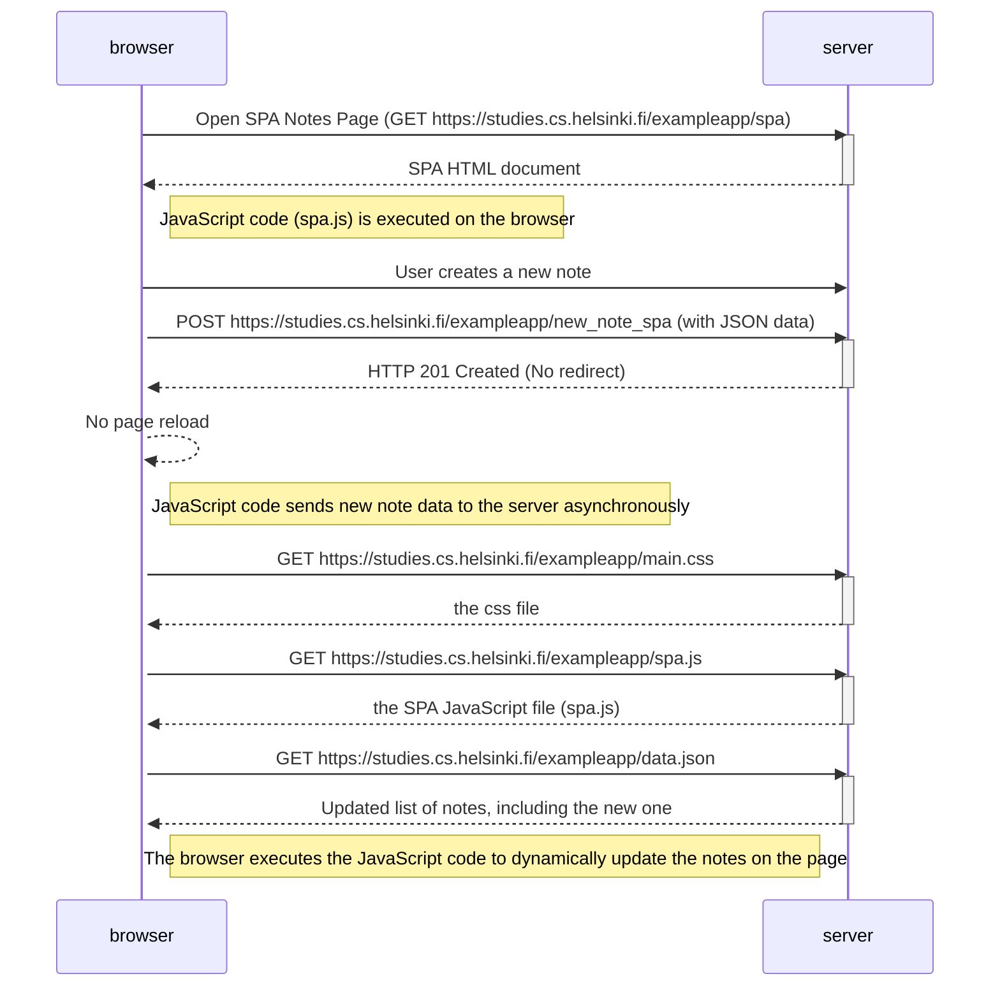

```mermaid
sequenceDiagram
    participant browser
    participant server

    browser->>server: Open SPA Notes Page (GET https://studies.cs.helsinki.fi/exampleapp/spa)
    activate server
    server-->>browser: SPA HTML document
    deactivate server

    Note right of browser: JavaScript code (spa.js) is executed on the browser

    browser->>server: User creates a new note
    activate browser
    browser->>server: POST https://studies.cs.helsinki.fi/exampleapp/new_note_spa (with JSON data)
    activate server
    server-->>browser: HTTP 201 Created (No redirect)
    deactivate server
    browser-->>browser: No page reload

    Note right of browser: JavaScript code sends new note data to the server asynchronously

    browser->>server: GET https://studies.cs.helsinki.fi/exampleapp/main.css
    activate server
    server-->>browser: the css file
    deactivate server

    browser->>server: GET https://studies.cs.helsinki.fi/exampleapp/spa.js
    activate server
    server-->>browser: the SPA JavaScript file (spa.js)
    deactivate server

    browser->>server: GET https://studies.cs.helsinki.fi/exampleapp/data.json
    activate server
    server-->>browser: Updated list of notes, including the new one
    deactivate server

    Note right of browser: The browser executes the JavaScript code to dynamically update the notes on the page

```
