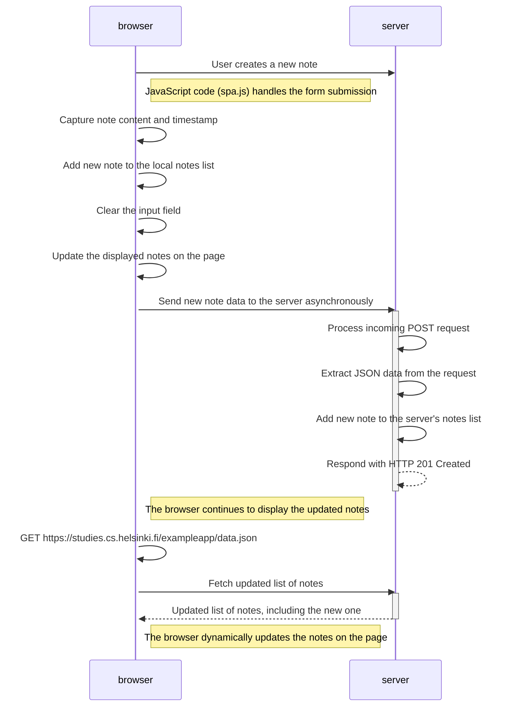

```mermaid
sequenceDiagram
    participant browser
    participant server

    browser->>server: User creates a new note
    activate browser
    Note right of browser: JavaScript code (spa.js) handles the form submission

    browser->>browser: Capture note content and timestamp
    browser->>browser: Add new note to the local notes list
    browser->>browser: Clear the input field
    browser->>browser: Update the displayed notes on the page
    browser->>server: Send new note data to the server asynchronously

    activate server
    server->>server: Process incoming POST request
    server->>server: Extract JSON data from the request
    server->>server: Add new note to the server's notes list
    server-->>server: Respond with HTTP 201 Created

    deactivate server

    Note right of browser: The browser continues to display the updated notes

    browser->>browser: GET https://studies.cs.helsinki.fi/exampleapp/data.json
    browser->>server: Fetch updated list of notes
    activate server
    server-->>browser: Updated list of notes, including the new one
    deactivate server

    Note right of browser: The browser dynamically updates the notes on the page

```
